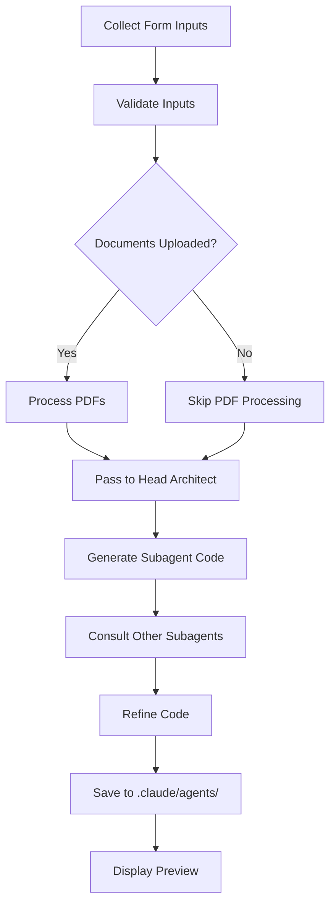

# Subagent Generator Desktop Application - Development Roadmap

## Project Overview
**Application Name**: Claude Subagent Generator  
**Technology Stack**: Electron + React + Material-UI + Node.js  
**Development Environment**: VSCode with Claude Code  
**Output**: Cross-platform desktop application for generating Claude Code subagents  
**Purpose**: Generate specialized subagents using a templated approach with optional document analysis

---

## Phase 1: Project Foundation & Setup (Day 1-2)

### 1.1 Repository Initialization
```bash
# Create project structure
mkdir claude-subagent-generator
cd claude-subagent-generator
git init
npm init -y

# Create .gitignore
echo "node_modules/" >> .gitignore
echo "dist/" >> .gitignore
echo ".env" >> .gitignore
echo ".DS_Store" >> .gitignore
```

### 1.2 Core Dependencies Installation
```json
{
  "name": "claude-subagent-generator",
  "version": "1.0.0",
  "description": "Desktop application for generating Claude Code subagents",
  "main": "src/main/index.js",
  "scripts": {
    "dev": "concurrently \"vite\" \"electron .\"",
    "build": "vite build && electron-builder",
    "preview": "vite preview",
    "dist": "electron-builder"
  },
  "dependencies": {
    "electron": "^27.0.0",
    "react": "^18.2.0",
    "react-dom": "^18.2.0",
    "@mui/material": "^5.14.0",
    "@emotion/react": "^11.11.0",
    "@emotion/styled": "^11.11.0",
    "pdf-parse": "^1.1.1",
    "electron-store": "^8.1.0",
    "@mui/icons-material": "^5.14.0"
  },
  "devDependencies": {
    "@vitejs/plugin-react": "^4.0.0",
    "electron-builder": "^24.0.0",
    "vite": "^5.0.0",
    "concurrently": "^8.0.0",
    "eslint": "^8.50.0",
    "prettier": "^3.0.0"
  }
}
```

### 1.3 Project Structure
```
claude-subagent-generator/
├── .claude/                  # Generated subagents directory
│   └── agents/               # Subagent .md files
├── src/
│   ├── main/                # Electron main process
│   │   ├── index.js         # Main process entry
│   │   ├── fileManager.js   # File system operations
│   │   └── ipcHandlers.js   # IPC communication
│   ├── renderer/            # React frontend
│   │   ├── index.html       # HTML entry point
│   │   ├── main.jsx         # React entry point
│   │   ├── App.jsx          # Root component
│   │   ├── components/
│   │   │   ├── TemplateForm.jsx
│   │   │   ├── DocumentUpload.jsx
│   │   │   ├── AgentPreview.jsx
│   │   │   ├── ThemeToggle.jsx
│   │   │   └── GenerateButton.jsx
│   │   ├── services/
│   │   │   ├── agentGenerator.js
│   │   │   ├── pdfParser.js
│   │   │   └── templateProcessor.js
│   │   ├── hooks/
│   │   │   ├── useTheme.js
│   │   │   └── useAgentGenerator.js
│   │   └── theme/
│   │       └── materialTheme.js
│   └── architect/           # Head architect agent
│       ├── headArchitect.js
│       └── subagentConsultant.js
├── public/
│   └── icon.png            # Application icon
├── package.json
├── vite.config.js
├── electron-builder.json
├── .gitignore
└── README.md
```

---

## Phase 2: Head Architect Agent Development (Day 3-4)

### 2.1 Create Head Architect Module
**File**: `src/architect/headArchitect.js`

#### Core Responsibilities:
- Parse template requirements from UI inputs
- Analyze uploaded PDF documents for context
- Generate subagent specifications
- Coordinate with auxiliary subagents for improvements
- Output formatted .md files to .claude directory

#### Key Functions:
```javascript
class HeadArchitect {
  constructor() {
    this.templateEngine = new SubagentTemplateEngine();
    this.consultants = new Map();
  }
  
  async generateSubagent(templateData, documents) {
    // Main generation logic
  }
  
  async consultWithSubagents(specification) {
    // Consultation logic for improvements
  }
  
  async saveToFile(agentCode, agentName) {
    // Save to .claude/agents/ directory
  }
}
```

### 2.2 Subagent Template Engine
```javascript
class SubagentTemplateEngine {
  parseTemplate(templateData) {
    // Parse all 12 input fields per category
  }
  
  validateRequirements(requirements) {
    // Ensure all required fields are present
  }
  
  generateSubagentCode(specifications) {
    // Create the actual agent code
  }
  
  formatMarkdownOutput(agentCode) {
    // Format as proper markdown
  }
}
```

---

## Phase 3: Frontend Development with Material-UI (Day 5-7)

### 3.1 Main Application Layout

#### Component Hierarchy:
```jsx
<ThemeProvider theme={currentTheme}>
  <CssBaseline />
  <Box sx={{ display: 'flex' }}>
    <AppBar position="fixed">
      <Toolbar>
        <Typography>Claude Subagent Generator</Typography>
        <ThemeToggle />
      </Toolbar>
    </AppBar>
    
    <Drawer variant="permanent">
      <List>
        {/* Navigation items */}
        <ListItem>Template</ListItem>
        <ListItem>Documents</ListItem>
        <ListItem>Preview</ListItem>
        <ListItem>History</ListItem>
      </List>
    </Drawer>
    
    <Box component="main">
      <Container maxWidth="lg">
        <TemplateForm />
        <DocumentUpload />
        <GenerateButton />
        <AgentPreview />
      </Container>
    </Box>
  </Box>
</ThemeProvider>
```

### 3.2 Material-UI Theme Configuration
```javascript
// src/renderer/theme/materialTheme.js
import { createTheme } from '@mui/material/styles';

export const lightTheme = createTheme({
  palette: {
    mode: 'light',
    primary: {
      main: '#1976d2',
    },
    secondary: {
      main: '#dc004e',
    },
    background: {
      default: '#fafafa',
      paper: '#ffffff',
    },
  },
  typography: {
    fontFamily: '"Roboto", "Helvetica", "Arial", sans-serif',
    h4: {
      fontWeight: 600,
    },
  },
});

export const darkTheme = createTheme({
  palette: {
    mode: 'dark',
    primary: {
      main: '#90caf9',
    },
    secondary: {
      main: '#f48fb1',
    },
    background: {
      default: '#121212',
      paper: '#1e1e1e',
    },
  },
  typography: {
    fontFamily: '"Roboto", "Helvetica", "Arial", sans-serif',
    h4: {
      fontWeight: 600,
    },
  },
});
```

### 3.3 Template Form Component Structure

#### Input Categories (12 fields each):
1. **Core Function Inputs**
2. **Domain Expertise Inputs**
3. **Input Types Inputs**
4. **Validation Rules Inputs**
5. **Output Format Inputs**
6. **Performance Constraints Inputs**
7. **Style Guide Inputs**
8. **Integration Target Inputs**

```jsx
// Example structure for each category
<Grid container spacing={2}>
  {[...Array(12)].map((_, index) => (
    <Grid item xs={12} sm={6} md={4} key={index}>
      <TextField
        fullWidth
        label={`Core Function ${index + 1}`}
        variant="outlined"
        value={coreFunctions[index]}
        onChange={(e) => handleCoreFunction(index, e.target.value)}
      />
    </Grid>
  ))}
</Grid>
```

---

## Phase 4: Backend Integration (Day 8-9)

### 4.1 Electron Main Process Setup

#### Main Process Features:
```javascript
// src/main/index.js
const { app, BrowserWindow, ipcMain } = require('electron');
const path = require('path');
const { setupIpcHandlers } = require('./ipcHandlers');

let mainWindow;

function createWindow() {
  mainWindow = new BrowserWindow({
    width: 1400,
    height: 900,
    webPreferences: {
      preload: path.join(__dirname, 'preload.js'),
      contextIsolation: true,
      nodeIntegration: false,
    },
  });
  
  setupIpcHandlers(mainWindow);
}

app.whenReady().then(createWindow);
```

### 4.2 PDF Document Processing
```javascript
// src/renderer/services/pdfParser.js
class DocumentProcessor {
  constructor() {
    this.maxDocuments = 12;
    this.documents = [];
  }
  
  async uploadDocuments(files) {
    if (files.length > this.maxDocuments) {
      throw new Error(`Maximum ${this.maxDocuments} documents allowed`);
    }
    // Process PDFs
  }
  
  async extractContent(pdfBuffer) {
    // Extract text from PDF
  }
  
  async analyzeBusinessRequirements(content) {
    // Analyze content for subagent suggestions
  }
  
  suggestSubagents(analysis) {
    // Return suggested subagent types
  }
}
```

---

## Phase 5: Agent Generation Pipeline (Day 10-11)

### 5.1 Generation Workflow



### 5.2 File Output Format
```markdown
# Subagent: [AGENT_NAME]
**Generated**: [TIMESTAMP]
**Version**: 1.0.0
**Type**: [SUBAGENT_TYPE]

## Specifications
### Core Function
[Generated from template inputs]

### Domain Expertise
[Generated from template inputs]

### Technical Requirements
[Generated from template inputs]

## Implementation
```python
# Generated subagent code
[Complete implementation]
```

## Usage Example
```python
# Example of how to use this subagent
[Usage code]
```

## Dependencies
- [List of required dependencies]

## Integration Notes
[Any special integration requirements]
```

---

## Phase 6: Testing & Refinement (Day 12-13)

### 6.1 Test Coverage Areas

#### Unit Tests:
- Form validation logic
- PDF parsing functionality
- Template processing
- Agent generation accuracy
- File system operations

#### Integration Tests:
- Electron IPC communication
- Theme switching persistence
- Document upload flow
- End-to-end generation

#### Cross-Platform Tests:
- Windows 10/11
- macOS (Intel & Apple Silicon)
- Ubuntu/Debian Linux

### 6.2 Claude Code Integration Testing
- Verify generated agents import correctly
- Test subagent execution in Claude Code
- Validate inter-agent communication
- Check markdown formatting compliance

---

## Phase 7: Build & Deployment (Day 14)

### 7.1 Build Configuration
```json
// electron-builder.json
{
  "appId": "com.claude.subagent-generator",
  "productName": "Claude Subagent Generator",
  "directories": {
    "output": "dist"
  },
  "files": [
    "src/**/*",
    "public/**/*",
    "package.json"
  ],
  "mac": {
    "category": "public.app-category.developer-tools",
    "icon": "public/icon.icns"
  },
  "win": {
    "target": "nsis",
    "icon": "public/icon.ico"
  },
  "linux": {
    "target": "AppImage",
    "category": "Development",
    "icon": "public/icon.png"
  }
}
```

### 7.2 Distribution Strategy
- **GitHub Releases**: Automated releases via GitHub Actions
- **Auto-updater**: Implement electron-updater for automatic updates
- **Documentation**: Comprehensive README and user guide
- **Version Control**: Semantic versioning (MAJOR.MINOR.PATCH)

---

## Development Commands Reference

```bash
# Initial setup
git clone <repository>
cd claude-subagent-generator
npm install

# Development
npm run dev                    # Start development server

# Testing
npm test                       # Run test suite
npm run test:unit             # Unit tests only
npm run test:integration      # Integration tests

# Building
npm run build                 # Build for production
npm run dist                  # Package application
npm run dist:mac             # macOS only
npm run dist:win             # Windows only
npm run dist:linux           # Linux only

# Utilities
npm run lint                  # Run ESLint
npm run format               # Run Prettier
npm run generate-agent       # CLI agent generation
```

---

## Key Implementation Guidelines

### 1. State Management
- Use React Context API for global state
- Implement useReducer for complex form state
- Persist user preferences with electron-store

### 2. File Operations
- All agents saved as `.md` files
- Maintain `.claude/agents/` directory structure
- Implement file versioning system

### 3. Input Validation
- Validate all 12 fields per category
- Provide real-time validation feedback
- Prevent generation with incomplete data

### 4. PDF Processing
- Enforce 12 document maximum
- Show upload progress
- Extract text efficiently

### 5. Theme System
- Persist theme preference
- Smooth transition animations
- System preference detection

### 6. Error Handling
- User-friendly error messages
- Logging system for debugging
- Graceful fallbacks

### 7. Performance
- Lazy load components
- Virtualize long lists
- Optimize PDF parsing

---

## Success Metrics Checklist

- [ ] **Cross-platform Launch**: Application runs on Windows/Mac/Linux
- [ ] **Agent Generation**: Successfully creates valid subagent files
- [ ] **PDF Integration**: Documents parse and influence generation
- [ ] **Form Functionality**: All input fields work correctly
- [ ] **Theme System**: Light/dark mode switches seamlessly
- [ ] **Claude Code Compatible**: Generated agents integrate properly
- [ ] **File Management**: .claude directory structure maintained
- [ ] **User Experience**: Intuitive interface with Material Design
- [ ] **Performance**: Generates agents in < 5 seconds
- [ ] **Error Recovery**: Handles errors gracefully

---

## Post-MVP Enhancements

### Version 1.1
- Agent versioning and rollback
- Template library/marketplace
- Batch agent generation
- Export/import templates

### Version 1.2
- Agent dependency management
- Built-in testing framework
- Performance benchmarking
- Collaboration features

### Version 2.0
- Cloud synchronization
- Agent marketplace integration
- AI-powered optimization suggestions
- Visual agent workflow builder

---

## Resources & References

### Documentation
- [Electron Documentation](https://www.electronjs.org/docs)
- [Material-UI Components](https://mui.com/components/)
- [React Documentation](https://react.dev)
- [Claude Code Guidelines](https://docs.anthropic.com)

### Development Tools
- VSCode with Claude Code extension
- React Developer Tools
- Electron DevTools
- Git version control

### Community & Support
- GitHub Issues for bug tracking
- Discord community for developers
- Regular update schedule (monthly)
- User feedback integration

---

## Contact & Contribution

**Repository**: `github.com/[username]/claude-subagent-generator`  
**Issues**: Report bugs and request features via GitHub Issues  
**Contributing**: Pull requests welcome following contribution guidelines  
**License**: MIT License

---

*Last Updated: [Current Date]*  
*Version: 1.0.0*
